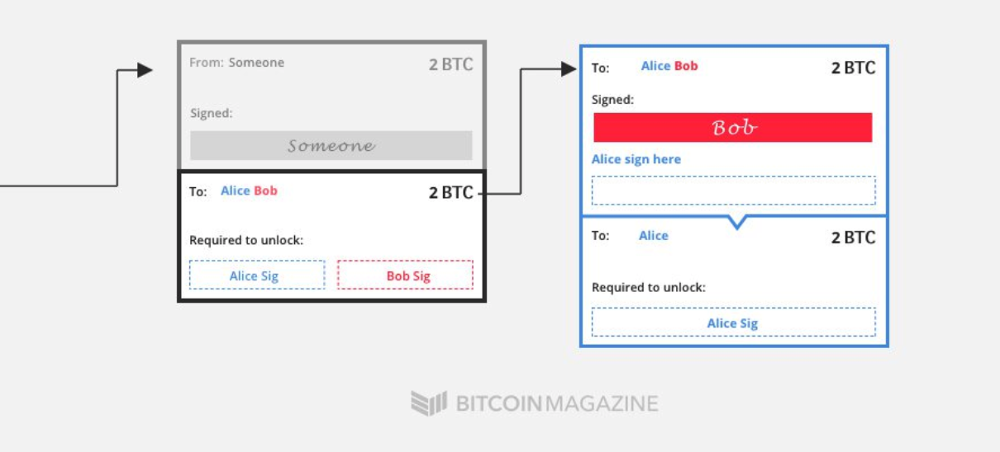
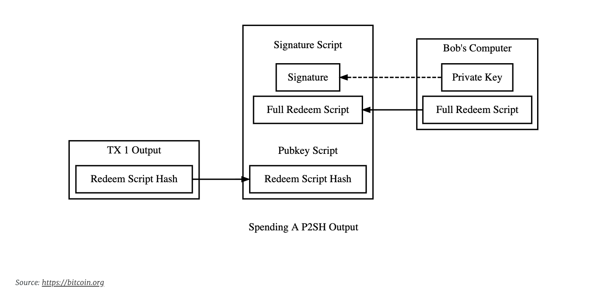
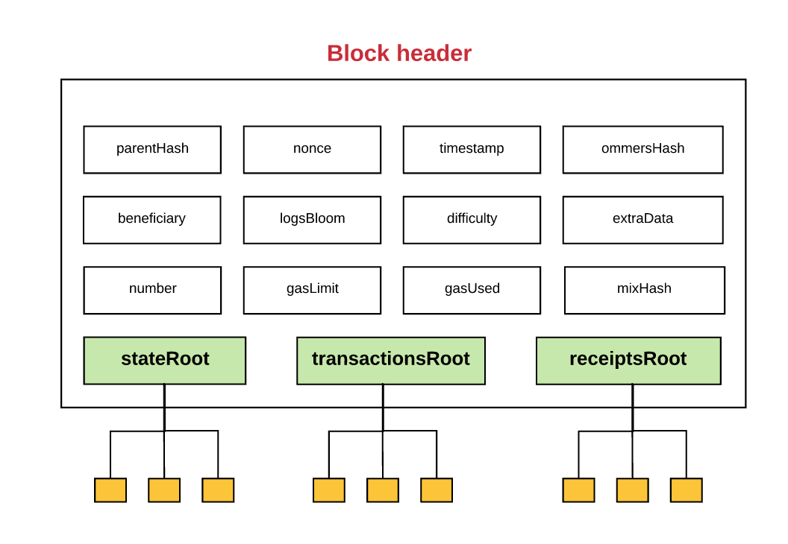

# A deep dive into smart contracts

In this post, we will cover the basics of smart contract - starting from when it first appeared in the Bitcoin blockchain to what it looks like today in Ethereum. We will cover what it means to be Turing complete and how Vitalik's proposal is one. Finally, we will look into how states are changed in Ethereum and end with some closing remarks. This post assumes prior knowledge of Bitcoin. If proof-of-work consensus or the spent/unspent transactional model is confusing to you, then refer to my previous post on [Bitcoin’s Trust Model](https://medium.com/@uneeb.agha/trust-model-of-bitcoin-part-i-34aacf47d444) where I introduce the basic concepts.

## The Bitcoin script

Most people think of Ethereum when they hear "smart contracts". While, it's true that Ethereum offers a wide array of functionalities with their smart contracts constructs, I personally believe that it makes sense to start from the Bitcoin script works and develop an intuition for where it lacks. If you would like to jump to Ethereum directly, skip this section.

### Beyond the simple TX

Satoshi's white-paper has no mention of Bitcoin script. It simply devised a system whereby a payer can use payee's public key and his own private key to encode a transaction that the payee can later reference. But as Bitcoin gained in popularity, it needed to do more than just that. For instance, if Bitcoin needed to be adopted by institutions, it needed a mechanism to pool transactions together. More concretely, Alice needs to send funds to both Bob and Charlie. And Bob shouldn't be able to take the funds out with Charlie's permission. And vice-versa. This gets complicated fast. What if Charlie leaves the company? What if Dan can optionally sign instead of Charlie? These form of signatures are known as multi-sigs and were introduced later through Bitcoin Improvement Proposals. Similarly, if Bitcoin were to work as a payment system, it needed to provide certain guarantees. What if I buy an iPhone with my Bitcoins, only to discover later that it had been tampered with. Who would I go to? Typically, buyers are protected through Escrow services. A party sits in the middle between buyer and seller and decides whether a certain item was indeed a wrongful purchase. You might thinking - ah! multi-signatures again. But not quite. What if the escrow service starts acting maliciously too and conspires against the seller. Hence there was a need in Bitcoin to set up time-locks. For instance, in this case, allow a certain type of transaction for X amount of time and after the expiry time, enable a different type of transaction. And now you need more than multi-sig and time-locks. You need conditionals.



### P2SH

There are [more](https://en.bitcoin.it/wiki/Contract) than just these two scenarios. How does Bitcoin solve this issue generically? One implementation could be that transactions are sent from one wallet to another wallet. And logic in baked into the wallet itself. Allowing a third-party to intervene and solve for such issues. However, this introduces a trust issue. A safer approach would be embed the logic in the transaction itself. This would minimize the attack surface and any transaction that doesn't comply with the rules would be considered void. So, instead of sending Bitcoin to a certain entity, you send it to a script. The script (commonly referred to as redeem script) has the logic baked that needs to be satisfied in order to claim the Bitcoins. It only returns true or false.



An example of a multi-signature redeem script looks as follows:

`OP_2 [A's pubkey] [B's pubkey] [C's pubkey] OP_3 OP_CHECKMULTISIG`

There are Opcodes for doing certain operations. Their encodings have been [standardized](https://en.bitcoin.it/wiki/Script#Opcodes) over time. In order to retrieve the Bitcoins in this transaction, you need to provide a signature that satisfies this script. An example of such signature would look as follows:

`OP_0 [A's signature] [B's signature] [serialized redeem script]`

A Bitcoin node can then use the combination of the signature and the script to validate whether the transaction was indeed valid or not. This is the gist of Bitcoin smart contracts. It was proposed in 2012 by Gavin Andresen as part of [Bitcoin Improvement Proposal: 16](https://github.com/bitcoin/bips/blob/master/bip-0016.mediawiki) and is commonly used today.

## Beyond the Bitcoin script

Bitcoin nodes comply with the scripting schema to give it meaning. But what about meaningless scripts? What if I stored garbage on the Bitcoin blockchain. The transaction is void. It doesn't make any sense to a Bitcoin node. But what if a different kind of node is able to comprehend it? You can create a meta-blockchain that processes various kinds of transactions and Bitcoin is just a subset of it. [Cryptograffiti](https://cryptograffiti.info/) allows you to write anything to the blockchain by simply using OP_RETURN Opcode followed by whatever text you want to write. A pointless venture. But an interesting experiment nonetheless.

### Colored coins

In January 2009, Satoshi Nakamoto announced release of Bitcoin v0.1, to which Hal Finney replied:

> Congratulations to Satoshi on this first alpha release. I am looking forward to trying it out.
> ...
> As an amusing thought experiment, imagine that Bitcoin is successful and becomes the dominant payment system in use throughout the world. Then the total value of the currency should be equal to the total value of all the wealth in the world. Current estimates of total worldwide household wealth that I have found range from \$100 trillion to \$300 trillion. With 20 million coins, that gives each coin a value of about \$10 million.

Wealth is not just captured in the form of currency, it also captured in assets. These assets can be persisted on the blockchain similar to Bitcoin. Bitcoins can be "colored" to represent an asset. This was the motivation behind Colored Coins. However, this system is beyond the scope of Bitcoin; which was to design a peer-to-peer Electronic Cash System. So maybe it makes sense to re-think what a blockchain is supposed to serve.

### Turing completeness

Bitcoin scripting language would have been considered Turing complete, if it were able to simulate universal Turing machine, i.e a Turing machine that can simulate an arbitrary Turing machine on arbitrary input. While the Bitcoin script does support conditionals (`OP_IF`, `OP_ELSE`, `OP_ENDIF`), it does not add anything to its memory. It simply processes what's provided to it in a stack-based sequential manner. This means that the Bitcoin script is limited in what it can do. It can't store states in a program. For instance, you can't create an organization where you list Alice's pubkey. Such rules can not be captured by the framework of Bitcoin's script.

Bitcoin proponents argue that increasing the expressiveness of the script is a useless endeavor and in fact, introduces more problems than solutions - as expressivity means that you have to be more careful with your code. What determines whether Bitcoin should introduce features such as multi-sig; time-locks; P2SH; but not a script that is Turing complete? This question has led to a lot of debates that still continue to this day<sup>[4]</sup>.

## Ethereum

Vitalik Buterin was the first person to identify this gap. In 2013, at the ripe age of 21, Vitalik started the project Ethereum - a blockchain with Turing complete scripting language. The language became known as Solidity. As opposed to the Bitcoin script, Solidity supported various programming constructs including conditionals and storing states for later retrieval. It opened up new possibilities. A _smart contract_ in Ethereum could be written by anyone, anywhere and deployed to the main Ethereum chain relatively cheaply - initiating a gold rush to find the next breakthrough. Let's dive a bit deeper into Solidity.

### Solidity

There is no better way to learn Solidity than by diving right into the code and making sense of it. Below is an example of a contract for multi-signature. The first thing to note is that there are multiple ways of implementing such contract. This is a result of increased expressivity. The following contract is a really simple way for two parties to deposit money into the contract. Once they are ready to transfer the funds, they can both approve the contract and call the send function to transfer all the funds.

Without going too much into the details of the semantics, let's get an overview of what the following contract attempts to achieve. Don't worry if you don't understand everything. In time, it will become more clear. If you still want to understand the code, refer to Solidity docs<sup>[5]</sup>.

```javascript
pragma solidity >=0.4.22 <0.6.0;

contract SimpleMultisig {

  address trustee1;
  address trustee2;

  mapping(address => bool) signed;

  constructor(address _trustee1, address _trustee2) public {
    trustee1 = _trustee1;
    trustee2 = _trustee2;
  }

  function approve() public {
    require (msg.sender == trustee1 || msg.sender == trustee2);
    require (signed[msg.sender] == false);
    signed[msg.sender] = true;
  }

  function send(address payable _receiver) payable public {
    require (signed[trustee1] == true && signed[trustee2] == true);
    _receiver.transfer(address(this).balance);
    signed[trustee1] = false;
    signed[trustee2] = false;
  }

  function getBalance() public view returns (uint256) {
    return address(this).balance;
  }

  function() external payable {
    // fallback for accepting Ether
  }
}
```

There are three variables: two addresses that refer to trustees whose signatures are required and a signed mapping that maps the address of the trustee to true or false values (depending on whether they have approved the amount for spending or not). The three named functions (`send`,`approve`, `getBalance`) do exactly what you'd expect from them to do: they allow the caller to approve sending the funds, actually send the funds and check the current balance in the contract. The contract also has an anonymous "fallback" function which accepts Ether. This is used for depositing Ether.

The actual process for invoking the contract would look something as follows:

1. Deploy the contract on Ethereum blockchain
2. Call the constructor and instantiate addresses for `trustee1` and `trustee2`
3. Deposit Ether in the contract by calling the fallback function and providing Ether as value in the contract invocation. This is not a parameter to the function.
4. Call `getBalance()` to check balance and ensure Ether was correctly deposited
5. Both trustees call `approve()`
6. One of the trustee calls `send` and provides the receivers address.
7. Call `getBalance()` to check balance and ensure Ether was correctly withdrawn

There are a couple of things to note here:

- There are multiple steps involved here that intervene with the blockchain. Multi-sig in Bitcoin, on the other hand, is a one-step process. As a result, it is more streamlined.
- The `SimpleMultiSig` contract is more flexible. For instance, instead of hardcoding two addresses, you can accept a variable number of addresses and have a flexible rule on how the `approve` function should behave.
- Since the invocation of the contract is a multi-step process, you need to take care of permissions. Who is allowed to take what action. This is done through `require` keyword, but there are other ways too.

At this point, the reader should start seeing the trade-offs between using Bitcoin smart contracts and Ethereum smart contracts. It should be obvious that Ethereum smart contracts are a lot more powerful and flexible. They can be used to create complex sequence of operations. Let's switch gears now and jump back into the theory.

### The state machine

Recall that in the Bitcoin blockchain, if you want to check balance of your wallet, you start from beginning of time, go forward block-by-block applying bloom filters to check whether there are transactions referencing your address(es) in the blocks. Once you find them, you follow along the sequence to figure out how your balance has changed through time and what it is currently.

This model of representing states by transactions doesn't map one-to-one in the Ethereum world. In an Ethereum smart contract (we will refer to it as just contract from now on), you have variables of all kinds. They need to be stored somewhere. In addition to that, you still have the classical Ether - which, on its own, functions quite similar to Bitcoin.

For this reason, you have two types of accounts in Ethereum:

1. Externally Owned Accounts (User accounts is controlled by private keys)
2. Contracts Accounts (controlled by code)


A state of an account is composed for 4 things:

1. Nonce: this is different from nonce present in the block. Its purpose is to prevent replay attacks. Essentially, this number represents the number of transactions sent from the account’s address.
2. Balance: _(self-explanatory)_
3. Code hash: hash of the contract code
4. Storage root: hash of the root node of Merkle-Patricia trie that encodes the storage contents of the account (key-value map)

Let's zoom in on the Merkle-Patricia trie. What exactly does that look like? The diagram is below, but it suffice to know that it essentially maps keys to their values in such a way that it is structured as a trie. Why? So that we can quickly check whether a certain state exists in the tree or not using a Merkle Proof<sup>[7]</sup>.


It seems like we have some way of modeling our account states (both contract and externally-owned). We can represent the states in our contracts and change them over time. But there are two questions left to be answered?

- Where exactly are the states persisted?
- How exactly does the state change?

The answer to the first question is, obviously, the blockchain. And in order to change the states, we need to create a new transaction that will be used in the next block. Recall that in the Bitcoin blockchain, each block contains multiple transactions. Similarly, in the Ethereum blockchain, each block contains multiple transactions as well as multiple state changes.



All state changes as well as transactions are again stored as merkle trees and their roots are part of the block header. I found an diagram that boldly attempts to summarize the full Ethereum blockchain mechanism. It's quite evolved, but for what it's worth, I'll leave it down below.


## Closing remarks

We have come a long way since the birth of a simple trust-less transaction on a blockchain. It has been 4 years since the inception of Ethereum. And today one can construct complex forms of transactions that can issue/burn Tokens to keep it pegged to the price of a dollar. Or issue loans that can generate interest. It does it all trustlessly. If Hal Finney's prophecy is to be true and cryptocurrency is indeed on its path to capture all wealth in the world; it needs to form an even more sophisticated framework that captures value of various kinds. Today, we are limited by only two things: scalability of the blockchain, and our imagination.

## References

[1]&nbsp;[Advanced Bitcoin scripting](https://www.youtube.com/watch?v=yU3Sr07Qnxg)
[2]&nbsp;[Bitcoin multisig the hard way: Understanding raw P2SH multisig transactions](https://www.soroushjp.com/2014/12/20/bitcoin-multisig-the-hard-way-understanding-raw-multisignature-bitcoin-transactions/)
[3]&nbsp;[Escrow example](https://bitcoin.org/en/contracts-guide#escrow-and-arbitration)
[4]&nbsp;[A conflict of crypto visions](https://medium.com/@arjunblj/a-conflict-of-crypto-visions-6f3e28066454)
[5]&nbsp;[Solidity docs](https://solidity.readthedocs.io/)
[6]&nbsp;[How does Ethereum work anyway](https://medium.com/@preethikasireddy/)
[7]&nbsp;[Merkling in Ethereum](https://blog.ethereum.org/2015/11/15/merkling-in-ethereum)
