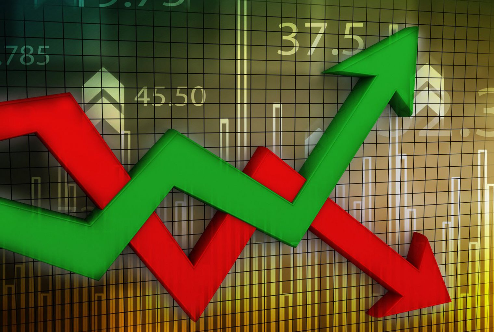

# Explaining MakerDAO: stablecoin

## Risk profiles

Volatility refers to the amount of uncertainty or risk related to the size of changes in a security's value. It can either be measured by using the standard deviation or variance between returns from the security. Different market participants have different risk profiles. Highly volatile assets present an opportunity for some, but for others it can be an exasperation. Some investors tend to seek steady earnings through either capital appreciation or yield. Others trade volatile assets to make money. In the world of blockchain, there is a dire need for low volatile assets, as they open up a new class of investing opportunities. This has led to a quest for stablecoins. Price is a function of supply and demand. And so, volatility is simply a result of the underlying **supply and demand** characteristics of the market.

## Bitcoin's supply and demand

Bitcoin is known quite well to be a volatile asset.

Use bitcoin volatility charts - investopedia
Power law

## Approach

There are quite a few approaches to this problem.

https://twitter.com/delitzer/status/1179754609599864832

Trickle down economics (QE profit sharing?)

https://prestonbyrne.com/2017/12/10/stablecoins-are-doomed-to-fail/

https://twitter.com/TrustlessState/status/1180146312970260486

## Stable coin

The CDP interaction process
Step​ ​1:​ ​Creating​ ​the​ ​CDP​ ​and​ ​depositing​ ​collateral
Step​ ​2:​ ​Generating​ ​Dai​ ​from​ ​the​ ​collateralized​ ​CDP
Step​ ​3:​ ​Paying​ ​down​ ​the​ ​debt​ ​and​ ​Stability​ ​Fee
Step​ ​4:​ ​Withdrawing​ ​collateral​ ​and​ ​closing​ ​the​ ​CDP

Pooled Ether

Price stability
Emergency shutdown

Multi-collateral

## Governance

https://en.wikipedia.org/wiki/Stablecoin

https://www.forbes.com/sites/shermanlee/2018/03/12/explaining-stable-coins-the-holy-grail-of-crytpocurrency/#7d288b424fc6

https://www.coindesk.com/1-million-loans-are-being-minted-on-makerdao-more-may-be-on-the-way

https://hackernoon.com/whats-makerdao-and-what-s-going-on-with-it-explained-with-pictures-f7ebf774e9c2

https://blockgeeks.com/guides/makerdao-stablecoin-blockgeeks-part-2/

https://blockonomi.com/maker-dao-guide/

https://cointelegraph.com/news/dai-has-been-struggling-to-maintain-its-1-peg-but-the-makerdao-community-believes-it-will-soon-be-cryptos-default-stablecoin

https://longcaller.com/coin/maker-dao.html

https://www.coindesk.com/dai-stablecoins-stability-fee-nears-20-after-latest-makerdao-vote

https://makerdao.com/en/whitepaper/

# References

[1]&nbsp;[Why are commodities more volatile than other assets?](https://www.thebalance.com/why-commodities-are-volatile-assets-4126754)
