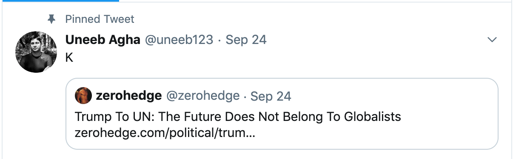
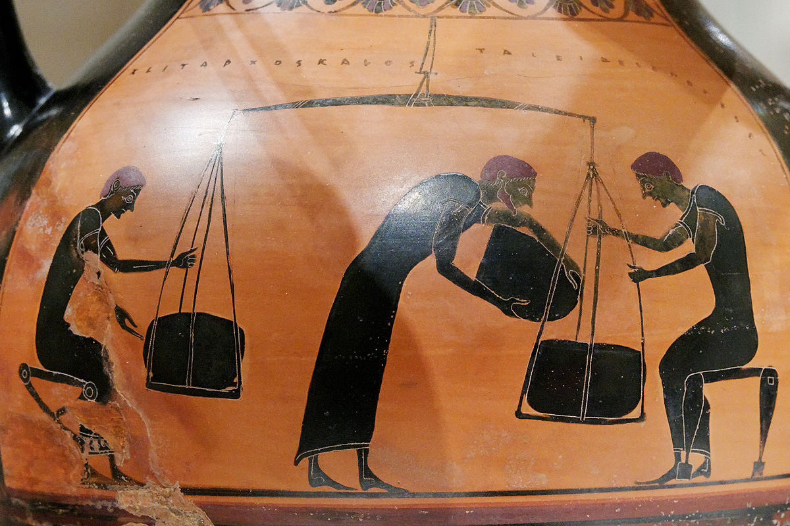
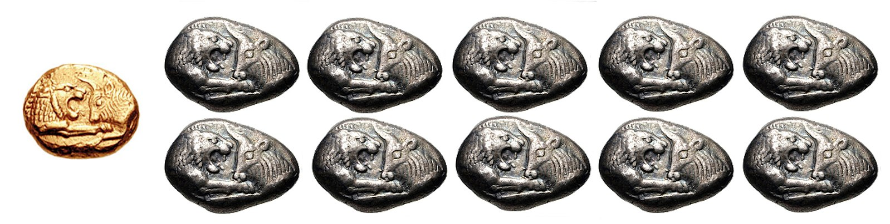

# Why you should care about cryptocurrency

More than a year ago, I was sitting in a meeting with an angel investor in Seattle at one of the WeWork locations. After exchanging quick intros, we jumped straight to business. I gave him the spiel about the cryptocurrency wallet I was working on, when he cut me off and asked:

> I have a very basic question for you. Why should I care? It's volatile. I can't use it to buy coffee. It takes an hour to purchase anything. It's only used for speculation.

I muttered a few unconvincing sentences, attempting my best to persuade him to take me more seriously. I was somewhat successful in the sense that he did promise a follow-up meeting. But I never went back. He was right. I didn't have the answers. It just wasn't meant for transactions. I had just quit my job at Amazon to pursue a track in cryptocurrency. I wasn't just going to drop the ball and accept defeat. There had to be some compelling use-cases for cryptocurrency. For the next few months or so, I tried to get a better understanding of what is going on.

In my investigations in the proceeding year, not only did I understood why there was so much enthusiasm among Bitcoiners, but I was also astounded by the impact cryptocurrency was going to have that I felt most people were oblivious to. Just as the Internet. But different this time around. I do believe I found the answers that I needed. Now I want to share them with you all. You be the judge. I solemnly believe that cryptocurrency is a remarkable feat of humankind and to really understand what is going on, we have to take a quick tour of economics and finance. We are truly on a cusp of something revolutionary.

### What is money?

Money is a **number**. A number that is used for _capturing value_. This value is represented as a unit in some framework. There are many frameworks. The dollar system is one such framework. A shoe can cost \$20 or \$2000, depending on how valuable you think it is. Reputation increases value of a commodity. Scarcity can also increase value. So does novelty. Value fluctuates based on supply and demand. It varies from region to region. It even depends on beliefs. It is relative and transferrable - sometimes immediately; at other times, at a set time in future. Either in one go or in chunks. In the monetary framework, the value is represented by some base units. The commodity that is desired to be purchased is the asset. The units are broken down into divisible denominations. How much is your car worth? You can find out by conducting an auction. Or you can list it on an order-book - whereby the asset goes into price discovery. Some days are good and the car is priced handsomely. On other days, it might seem under-priced. Unfortunately for you, you are not able to control the sentiments of the potential buyers. A good salesman can try to sway the opinion, but that has its limitations too. In this sense, the purpose of money is to simply assign value to an asset.

That's not all though. The money system needs to be constructed and preserved. It needs to be represented in some form - having some desirable properties. It needs to be secure. It needs to be distributed. And _ideally_, it needs to be easy to use.

How does it exist? What is it based on? What value does it carry? To that end, there are two broad categories: Aristotle's "metallist" and Plato's "chartalist". In metallist economic theory, the value of the currency derives from the market value of the commodity upon which it is based [1]. As the name implies, precious metals such as gold and silver of fixed weights are ideal forms of metallist currency. There is no trusted intermediary. In chartalism, on the other hand, money derives its value mainly from the authority of the state [2]. Fiat currency, the predominant form of currency that we use today, is a special case of chartalism, whereby money is established through government regulation. Both forms of money have existed in tandem throughout history.

### I owe you

Trade is driving force behind change and progress
merchant/guild
Venice banks
https://en.wikipedia.org/wiki/History_of_banking
But that's not the money we are familiar with today.

Credit theory of money
https://en.wikipedia.org/wiki/Credit_theory_of_money
Graeber

Central banks
Trade/bill of exchange (https://en.wikipedia.org/wiki/History_of_money)
System of systems

https://en.wikipedia.org/wiki/Fiat_money
https://en.wikipedia.org/wiki/History_of_money
https://en.wikipedia.org/wiki/Central_bank (also use the picture)

### The models are broken

https://en.wikipedia.org/wiki/Nixon_shock

### Humble beginnings

### Austrain economics hard money

### Video of that dude

### Global

### Internet value

### Decentralized

### Problems

One question I asked myself before getting into the world of cryptocurrency was: do we really need it?
One of the most commonly asked question I ask myself is: why do we need cryptocurrency? What's wrong with state-issued currency?

[go for r/programming and hackernews]

working on more stuff; follow on Twitter

I am working on a framework

# References

[1]&nbsp;[Metallism](https://en.wikipedia.org/wiki/Metallism)
[2]&nbsp;[Chartalism](https://en.wikipedia.org/wiki/Chartalism)
