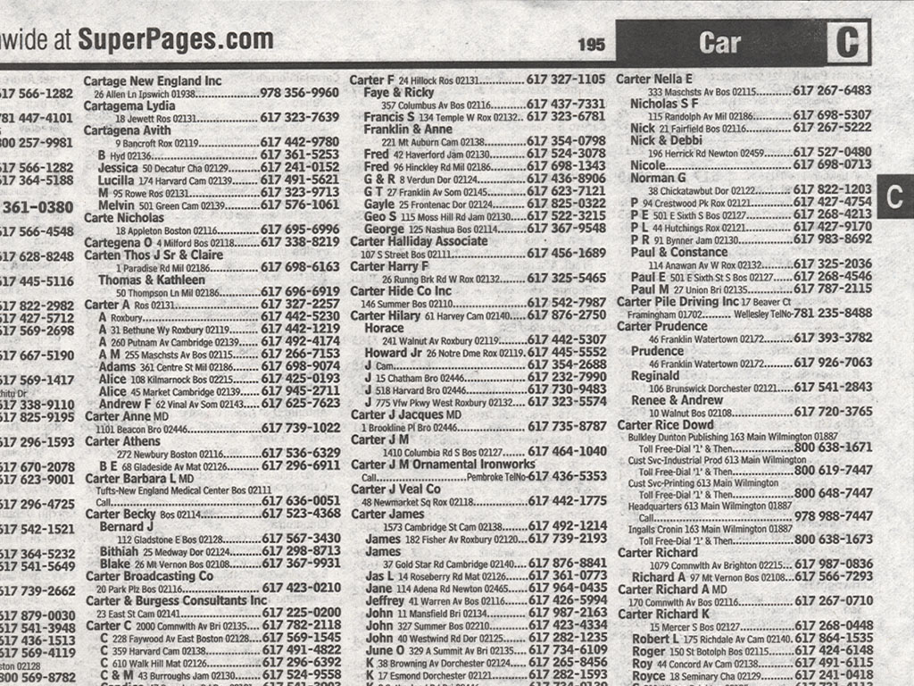

# Evolution of the database

Data is any sequence of one or more symbols that is given meaning by interpretation. Consider if an alien-being comes across your high school transcript. It wouldn't be able to understand anything from it. That's data. However, once given context, information can then be extracted from the data providing insights. Thus, data itself is just some representation - either in a form of ones and zeros; or latin symbols; or pictorial diagrams; or any form at all.

Data needs to stored. Sometimes for a few milliseconds and sometimes years - even millennia. Data, also, needs to retrieved. Sometimes often; and other times barely ever. It also needs to arranged. You don't want to stuff all your files in one giant drawer. Digital information is stored on disk drives, but it can grow arbitrarily large, requiring a flexible solution. To satisfy these requirements, we have built data management software systems known as **databases**.

## History

Let's put things in perspective.

### 1950s-1970s

The first hard disk drive from IBM in 1957. It was called the IBM Model 350 Disk File and was a huge device that weighed almost one ton. Its design was motivated by the need for real time accounting in business. It could store 3.75 MB of data [1] and data transfer rate was 8,800 characters per second. That's roughly equal to five million characters. Funnily enough, the research unit wanted to increase the storage capacity of the drive, but the marketing team wasn't sure how they'd sell it. Nevertheless, the drives continued to get bigger in the next few decades. By 1973, they had reached the size of nearly 150 MB, with data transfers rates of 885 kB/s.

IBM also pioneered in introducing a new level of data hierarchy with secondary storage. That saw competition in the market and today that is manifested in the form of SSD vs. HDD. The secondary storage was less expensive and slower than the main memory.

### 1980s, the transition to the PC era

### 1990s

### 2000s

## CAP Theorem

link to article
nodes in a network pool
add new nodes
open network
zookeeper - quorum
mongodb/hbase
sql
split-brain
spark
kafka

## Types

Navigational database 1960s
https://en.wikipedia.org/wiki/Navigational_database

# References

[1]&nbsp;[History of disk drives](https://en.wikipedia.org/wiki/History_of_hard_disk_drives)
[2]&nbsp;(https://en.wikipedia.org/wiki/Database#History)
