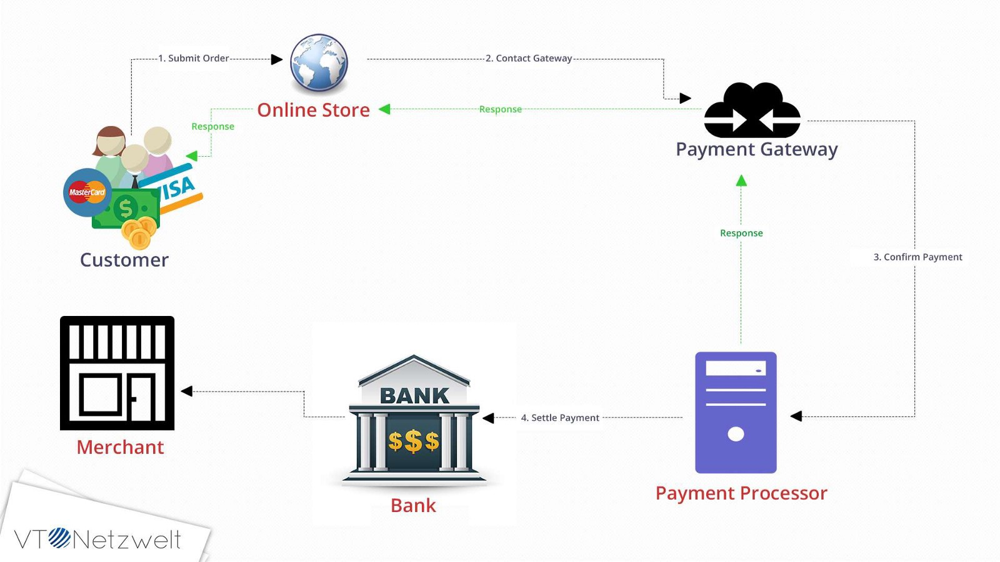

# What does the future of blockchain technology look like?

## Let's review

### The technology

For those who have been keeping up so far, we have gotten an open model for an extremely slow database whereby to write any record, not only do you have to comply with a schema, but you also have to wait for your turn by cracking a math problem based on random shuffling that typically takes about 10 minutes to solve (in Bitcoin). It ensures consistency at the expense of write-speed\*. Additionally, the database re-adjusts its difficulty such that regardless of the compute power of the underlying hardware, it still takes 10 mins on average to write any new record. This obviously makes it an inherently slow process. This mechanism, by the way, is known as proof of work. And it is widely recognized as the most trustless way of sending transactions. It is trustless because there is no reliance on any intermediary. In that sense, it is purely peer-to-peer money that cannot be attacked by anyone.

### The utility

The benefit is of this consistency over speed architecture is that anyone can participate by joining the network. The downside is that the more people join the network, the more energy is consumed. There are debates over utility of such networks. Whether their whole purpose is to simply facilitate illegal activities. There is some amount of truth to that. On visiting old [Bitcoin forums](https://bitcointalk.org/), one can see quite clearly that the earliest businesses that were established on Bitcoin attracted further privacy features such as coin mixing which allowed for money laundering and facilitated gambling. On top of that, there were tons of scandals. But since blockchain is just public payment system, it is [quite easy to probe into it](https://www.blockchain.com/explorer). And thus, conducting illegal activity using Bitcoin will only get you public scrutiny. Legitimacy of Bitcoin has been seriously questioned and as we have learnt over years, it is actually quite hard to shut down the network. It requires unanimous coordination from all different internet service providers and even then, a Bitcoin network might only just stop operating while the curfew is in place.

Proponents of Bitcoin admire the technology and argue that in a lot of ways, any technology in its nascent stages is used for working around the system. But over time, more usefulness is uncovered and more utility is extracted from it. So far, in its 10 year history, blockchain technology has managed to successfully **challenge governments** and provide a useful store of value. Since the amount of Bitcoins are capped at 21 million, it is one of the **hardest forms of money**; land and gold are the other two well-known assets having this property. Bitcoin exchanges all over the world, provide liquidity and hence enable **speculative trading**. Being a highly volatile asset, it is particularly suited for trading. On top of this, due to the slow speed of transactions, cryptocurrencies are **not well-suited for daily usage**. Even when purchasing is done on Bitcoin, most point-of-sale-systems actually use payment processors such as Bitpay or Coinbase, which are based on traditional architecture that simply settle payments on Bitcoin eventually. But the original transaction between the merchant and payer is conducted over legacy infrastructure.

## Improving on Bitcoin

Now that we have loosely defined what key aspects blockchain design lacks, let's examine solutions that promise to build on the current model. Before I get into these models, I want to emphasize that ever since Bitcoin was first released, it has been criticized on one note or the other. Yet, it continues to be the most widely recognized asset with a hefty price tag. This is a testimony to the fact that despite all its drawback, _the core idea has resonated with the masses_. Social acceptance is the ultimate criteria for post-evaluating success of any product. And no matter how the technology emerges in the future, it will continue take inspiration from the original form. Comparing its success to a mania is a futile exercise. It's a blanket statement that simply shields one's own ignorance. Only diving into the technicals and figuring out its flaws gives one the credibility to make a case. It is what bursts the bubble.

### Smart contracts

Ethereum
Tezos
Decred
Monero
Zcash
Dfinity
Hedera Hashgraph
Enterprise - Hyperledger

Now let's break all those use-cases apart and understand in more depth whether we do need a better blockchain.

### Payment processors

### Remittance

### Decentralized data store

### Web 3.0 tooling

Paying for data

Speed of transactions in MakerDAO/Compound
Speed of transactions in Traditional Finance
Lightning Network

Charts/data to back it up

Payments

[*] Another reason for being slow is that the sequence of records can change depending how aggresively they had been broadcasting on the network. If noone saw it, it doesn't exist. Similarly, if 50% saw one sequence and the other 50% saw the other sequence, then we have divide. Which gets resolved on the next turn. This means that you are advised to wait an hour before the transaction can be considered complete. Interestingly, Ethereum has managed to bring down the block time to 15 seconds - thanks to a more efficient way of dealing with diverging chains (more info here: https://www.reddit.com/r/ethereum/comments/5lzif2/why_are_eth_confirmations_so_much_faster_than_btc/)
