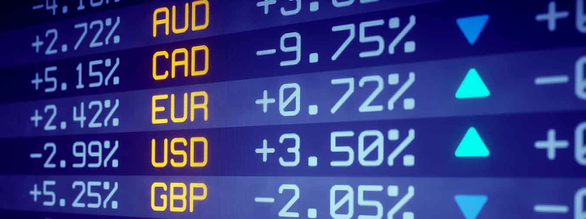
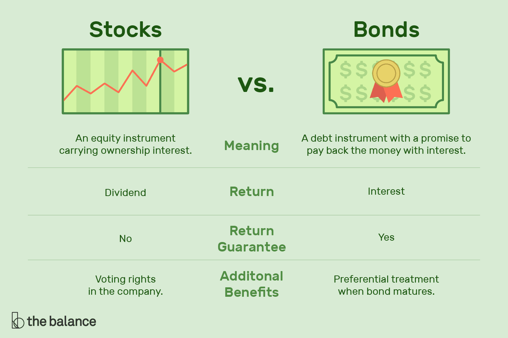

# Unbundling Compound Finance

## What is Compound Finance?

Compound Finance describes itself as a decentralized protocol which establishes _money markets_ with algorithmically set _interest rates_ based on supply and demand, allowing users to frictionlessly exchange the time value of Ethereum assets.

Before getting into Compound Finance, let's visit the world of traditional finance. And understand how everything works together there.

## Traditional finance

Replace this

**Financial market** is a broad term used for describing any forum where buyers and sellers meet to trade assets - usually financial securities such as stocks, bonds, currencies, options, and derivatives. Financial markets are a cornerstone to the capitalistic economy. Because they help facilitate _capital formation_ and _liquidity_ for entrepreneurs and businesses.

Financial markets create liquidity by making it easy for buyers and sellers to trade their financial holdings. Without the infrastructure of a market, sellers would have to seek individual buyers using less efficient methods such as classified ads - much in the same way someone sells a used car. In addition, the centralized location provides transparency for price and availability, and better subjects the securities to market forces of supply and demand. This, in turn, assures buyers and sellers of a fairer price than they might otherwise receive in a single, private transaction. Because they are subject to supply and demand forces, financial markets sometimes experience wide volatility due to the unemployment rate, GDP and housing prices1.

### Types of Financial markets

#### Forex Market

The foreign exchange market (also known as forex or currency trading market or fx) is a market in which participants can buy, sell, exchange and speculate on currencies. It is the most liquid market in the world, as cash is the most liquid of assets. It is also the largest financial market with over \$5 trillion in daily transactions, which is more than the futures and equity markets combined.

There is no central location, instead money is traded through a network of international dealers and brokers. Businesses use the forex market when they are buying products from other countries. Unlike a stock, currency valuations are relative to other currencies. There are many factors that contribute to a change in exchange rate: monetary policy, political stability, interest rates, and imports and exports2.

#### Capital Market

Capital markets are venues where savings and investments are channeled between the suppliers who have capital and those who are in need of capital. The entities who have capital include retail and institutional investors while those who seek capital are businesses, governments, and people3.

The most common capital markets are the stock market and the bond market.

##### Bond market

The bond market (often called the debt market or credit market) is a financial marketplace where investors can trade in government-issued and corporate-issued debt securities. Governments typically issue bonds in order to raise capital to pay down debts or fund infrastructural improvements. Publicly-traded companies issue bonds when they need to finance business expansion projects or maintain ongoing operations.

Big-name bond indices include Barclays Capital Aggregate Bond Index, the Merrill Lynch Domestic Master and the Citigroup U.S. Broad Investment-Grade Bond Index. They manage and measure bond portfolio performance.

##### Stock market

Capital markets are composed of primary markets (where participants can issue new debt) and secondary markets (where participants can buy and sell debt securities). The primary goal of a bond market is to provide long-term funding for public and private expenditures.

#### Over-the-Counter Markets

The over-the-counter (OTC) market is an example of a secondary market. An OTC market handles the exchanging of public stocks not listed on the NASDAQ, New York Stock Exchange or American Stock Exchange. Companies with stocks trading on the OTC market are usually smaller organizations, as this financial market requires less regulation and is less expensive to be traded on.

#### Financial Markets for Bonds

A bond is a security in which an investor loans money for a defined period of time at a pre-established rate of interest. Bonds are not only issued by corporations but may also be issued by municipalities, states, and federal governments from around the world. Also referred to as the debt, credit or fixed-income market, the bond market sells securities such as notes and bills issued from the United States Treasury.

#### Money Markets

A money market is a portion of the financial market that trades highly liquid and short-term maturities. The intention of the money market is for short-term borrowing and lending of securities with a maturity typically less than one year. This financial market trades certificates of deposit, banker’s acceptances, certain bills, notes, and commercial paper.

#### Derivatives Market

The derivatives market is a financial market that trades securities that derive its value from its underlying asset. The value of a derivative contract is determined by the market price of the underlying item. This financial market trades derivatives including forward contracts, futures, options, swaps, and contracts-for-difference.

---

Primary and secondary markets

### Money markets

any forum buys sellers meet trade assets securities , stock, bonds, currencies, options, curren
cornerstone capital formation liquidity
liquidity to trade finna
sellers individual buyers ads used car
centralized location -> transparency availability, market forces supply and demand, fair price
supply/demand -> volatility, unemployment
20th century -> the NYSE financial market face-to-face
NASDAQ lack of physical location

The stock market is a financial market that enables investors to buy and sell shares of publicly traded companies. The primary stock market is where new issues of stocks are first offered. Any subsequent trading of stock securities occurs in the secondary market.

Financial market prices may not indicate the true intrinsic value of a stock due to macroeconomic forces like taxes. In addition, the prices of securities are heavily reliant on informational transparency to ensure efficient and appropriate prices are set by the market.

### Types of Financial markets

- markets buyer and sellers
- securities
- capitalist cornerstone
- capital formation and liquidity
- easy (classified ads)
- transparency (supply/demand)
- volatility/true intrinsic value (macroeconomic forces)
- NYSE vs NASDAQ (Internet)

The stock market is a financial market that enables investors to buy and sell shares of publicly traded companies.

types:

- OTC
- Bonds <<- what is that?
- Money markets
- Derivatives market
- Forex market

## Problems

- closed
- NASDAQ online, but NYSE face-to-face

## References

[1]&nbsp;[Financial Market](https://www.investopedia.com/terms/f/financial-market.asp)
[2]&nbsp;[Forex Market](https://www.investopedia.com/terms/forex/f/forex-market.asp)
[3]&nbsp;[Capital Markets](https://www.investopedia.com/terms/c/capitalmarkets.asp)

The money market is the trade in short-term debt investments. It is characterized by a high degree of safety and a relatively low return in interest. On the widest scale, the money market is one of the pillars of the global financial system and involves overnight swaps of vast amounts of money between banks and the U.S. government. In all cases, they are low-risk investments that have maturities ranging from overnight to just under one year. That short life makes them almost as liquid as cash. That is, the principal is safe and the money is not inaccessible for long.

---

- Crypto -> gold

https://www.mycryptopedia.com/what-is-compound-finance-a-detailed-beginners-guide/

- creation of money markets on the Ethereum blockchain
- individuals and institutions are able to earn interest on digital assets that they supply to the protocol
- the financial concept, ‘the time value of money’, which stipulates that money in the present is worth more than the identical sum of money that is received in the future
- problem found with holding digital assets, which is financial yield
- lenders that are seeking to earn a return on non-yielding digital assets, and borrowers that are seeking to use borrowed assets for productive or investment use
- **money markets** are where financial instruments with high liquidity and short maturities are traded
- will lend to the protocol itself. The compound protocol then aggregates the supply of lent funds, resulting in a high level of liquidity for that money market
- withdraw their tokens at any time
- Price Oracle, which keeps track of the current exchange rate of each supported digital asset on the protocol.
- The responsibility of setting the value of assets on the protocol is delegated to a committee, which pools the prices of supported assets from the top 10 exchanges in the cryptocurrency space. These exchange rates are used by the protocol to determine the borrowing capacity and collateral requirements for an account, and any other function that requires calculating the value equivalent of an account on the protocol.
- interest rate mechanism
- Liquidation
- governance model for Compound is to start off as being under centralized control. However, it is intended that, over time, control of the protocol will transition to the community

https://compound.finance/developers#money-market

- rDai
- open oracle system
- wBTC
