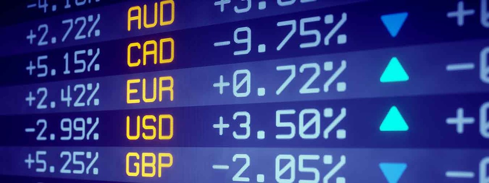
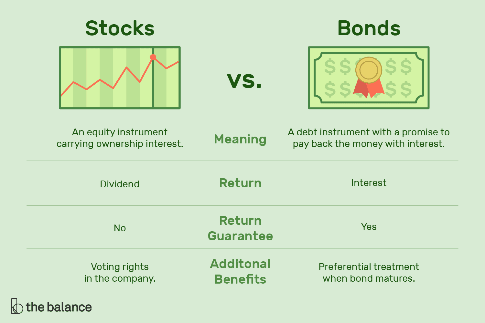
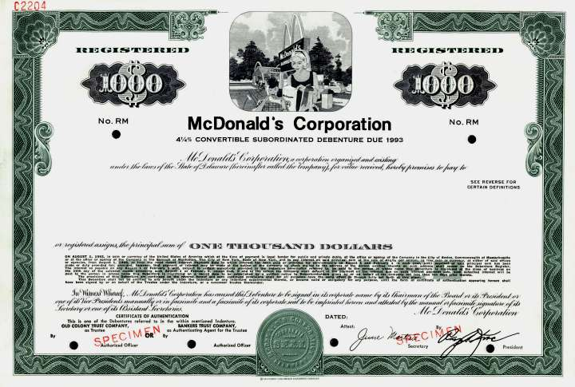
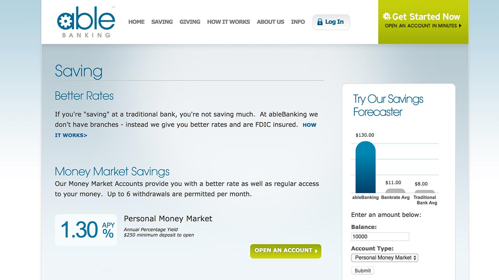

# Introduction to Financial Markets

**Financial market** is a broad term used for describing any forum where buyers and sellers meet to trade assets - usually financial securities such as stocks, bonds, currencies, options, and derivatives. Financial markets are a cornerstone to the capitalistic economy. Because they help facilitate _capital formation_ and _liquidity_ for entrepreneurs and businesses.

Financial markets create liquidity by making it easy for buyers and sellers to trade their financial holdings. Without the infrastructure of a market, sellers would have to seek individual buyers using less efficient methods such as classified ads - much in the same way someone sells a used car. In addition, the centralized location provides transparency for price and availability, and better subjects the securities to market forces of supply and demand. This, in turn, assures buyers and sellers of a fairer price than they might otherwise receive in a single, private transaction. Because they are subject to supply and demand forces, financial markets sometimes experience wide volatility due to the unemployment rate, GDP and housing prices1.

## Types of Financial markets

### Forex Market

The foreign exchange market (also known as forex or currency trading market or fx) is a market in which participants can buy, sell, exchange and speculate on currencies. It is the most liquid market in the world, as cash is the most liquid of assets. It is also the largest financial market with over \$5 trillion in daily transactions, which is more than the futures and equity markets combined.

There is no central location, instead money is traded through a network of international dealers and brokers. Businesses use the forex market when they are buying products from other countries. Unlike a stock, currency valuations are relative to other currencies. There are many factors that contribute to a change in exchange rate: monetary policy, political stability, interest rates, and imports and exports2.

### Capital Market

Capital markets are venues where savings and investments are channeled between the suppliers who have capital and those who are in need of capital. The entities who have capital include retail and institutional investors while those who seek capital are businesses, governments, and people3.

The most common capital markets are the stock market and the bond market.

#### Stock market

A stock market is where shares in corporations are issued and traded. Stock markets are a key component in a free market economy4. Stock markets serve two main functions:

1. From a company perspective, the stock market provides access to capital; usually in the form of cash. If a company needs to finance a major project, it can sell it shares in the stock market to raise capital instead of borrowing the money from the bank.
2. From the shareholder perspective, the stock market provides a way to participate in a company's growth and also quickly convert shares into cash.

This happens in two main ways.

**Primary market:** In a privately held company, stock holders are usually comprised of founders and initial investors who can sell their shares on the stock market exchange and reap the reward for the risk they took in creating and growing their business venture.

**Secondary market:** For investors who own shares in publicly traded companies, the stock market allows them to participate in a growth of a company without taking the risk of starting the company themselves.

The two main stock markets in the U.S are the NYSE and the NASDAQ. Foreign stock exchanges include London Stock Exchange, Hong Kong Stock Exchange, Euronext and Deutsche Bourse. In the early days of the stock market, stocks were traded on the floor of the exchange person-to-person. Now almost all stock trades are done electronically.

#### Bond market

The bond market (often called the debt market or credit market) is a financial marketplace where investors can trade in government-issued and corporate-issued debt securities. Governments typically issue bonds in order to raise capital to pay down debts or fund infrastructural improvements. Publicly-traded companies issue bonds when they need to finance business expansion projects or maintain ongoing operations5.

The bond market is broadly segmented into two different silos.

**Primary market:** Transactions occur directly between the bond issuers and the bond buyers. In essence, the primary market yields the creation of brand new debt securities that have not previously been offered to the public.

**Secondary market:** Securities that have already been sold in the primary market are then bought and sold at later dates. Investors can purchase these bonds from a broker, who acts as an intermediary between the buying and selling parties. These secondary market issues may be packaged in the form of pension funds, mutual funds, and life insurance polices—among many other product structures. However, unlike stocks, most bonds are not traded in the secondary market via exchanges. Rather, bonds are traded over the counter (OTC). There are several reasons why most bonds are traded OTC, but chief among them is their diversity.

### Money Markets

Money markets are _safe_, _liquid_ investments that are well-suited to the small investor. They typically invest in steady funds such as treasury bills and commercial paper. Money market funds are short-term, so funds are invested for a limited period of time. Treasury funds or commercial paper funds last one year or less and 270 days respectively. Many money market funds offer the option of selling the fund usually for a smaller profit than if the money had stayed in the account until the term ended6.

At a retail-level, opening a money market account is as simple as opening a saving account with a few differences. The account usually requires a minimum balance to open and be maintained at, and you must leave the money in your account for a specific time period. While money market funds do not yield a huge return, they boast higher interest rates than most savings accounts and are more convenient for short-term investors.

However, most money market transactions are wholesale, meaning they are for large denominations and take place between financial institutions and companies rather than individuals.

There are several money market instruments, including treasury bills, commercial paper, bankers' acceptances, deposits, certificates of deposit, bills of exchange, repurchase agreements, federal funds, and short-lived mortgage and asset-backed securities. The instruments bear differing maturities, currencies, credit risks, and structure and thus may be used to distribute exposure. The core of the money market consists of interbank lending - banks borrowing and lending to each other using commercial paper, repurchase agreements and similar instruments7.

#### Examples of money market instruments

**Treasury bills:** The U.S government issues a variety of debt obligations to finance its operations. Those with the short maturity are called Treasury bills (or T-bills). One of the unique features of the T-bills is that the government does not make regular interest payments to the holder, instead the securities are sold at a price below the face value - resulting in a profit at the maturity date8.

**Commercial paper:** Commercial paper is an unsecured, short-term debt instrument issued by a corporation, typically for the financing of accounts payable and inventories and meeting short-term liabilities. Maturities on commercial paper rarely range longer than 270 days (avoiding SEC registration and as a consequence, being less costly). Commercial paper is usually issued at a discount from face value and reflects prevailing market interest rates. Since it is unsecured, buyers have no claim on the company's assets if the company fails to pay at maturity9.

#### Interbank lending market

The interbank lending market refers to the subset of bank-to-bank transactions that take place in the money market. Banks are key players in several segments of the money market. To meet reserve requirements and manage day-to-day liquidity needs, banks buy and sell short-term un-collateralized loans in the federal funds market. Federal funds are overnight borrowings between banks and other entities to maintain their bank reserves at the Federal Reserve. Banks keep reserves at Federal Reserve Banks to meet their reserve requirements and to clear financial transactions.

### Derivatives Market

The derivatives market is a financial market that trades securities that derive its value from its underlying asset. The value of a derivative contract is determined by the market price of the underlying item. This financial market trades derivatives including forward contracts, futures, options, swaps, and contracts-for-difference.

## References

[1]&nbsp;[Financial Market](https://www.investopedia.com/terms/f/financial-market.asp)
[2]&nbsp;[Forex Market](https://www.investopedia.com/terms/forex/f/forex-market.asp)
[3]&nbsp;[Capital Markets](https://www.investopedia.com/terms/c/capitalmarkets.asp)
[4]&nbsp;[Stock Market](https://www.investopedia.com/terms/s/stockmarket.asp)
[5]&nbsp;[Bond Market](https://www.investopedia.com/terms/b/bondmarket.asp)
[6]&nbsp;[Money Market](https://www.investopedia.com/terms/m/moneymarket.asp)
[7]&nbsp;[Money Market wiki](https://en.wikipedia.org/wiki/Money_market)
[8]&nbsp;[Treasury bill](https://www.investopedia.com/terms/t/treasurybill.asp)
[9]&nbsp;[Commercial paper](https://www.investopedia.com/terms/c/commercialpaper.asp)
[10]&nbsp;[Interbank lending market](https://en.wikipedia.org/wiki/Interbank_lending_market)
[11]&nbsp;[Federal funds](https://en.wikipedia.org/wiki/Federal_funds)
