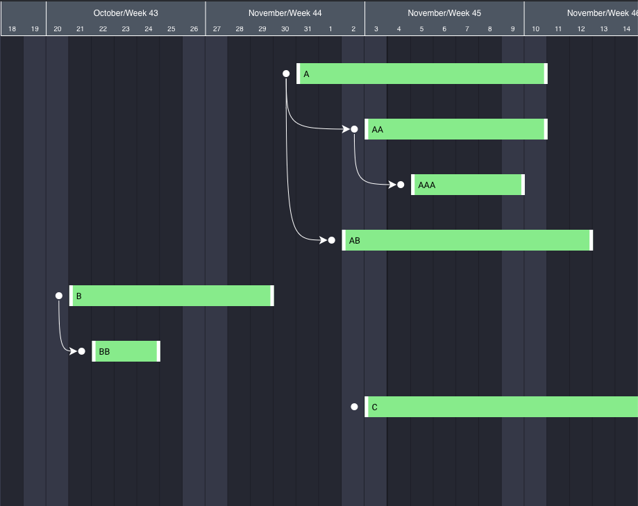

# How to build Gantt chart in D3.js

Recently I was tasked with the assignment of building a gantt chart for a project management tool. For those of you who don't already know what the gantt chart is, it looks like the following:


The key idea being to be able to visualize progress of tasks for a certain project. The timeline on the x-axis, while tasks are on y-axis. Now, if you are wondering that wouldn't it be neat if we can customize the chart to suit our needs. For instance, what if instead of just showing the progress bar, we also know who is working on these tasks. Or maybe represent our Q3 goals on the same chart too. Well, you are in great luck. I am going to show you exactly how to build a gantt chart ground up using D3. But before that, let's just quick ask ourselves...

### Why D3?

D3 stands for data-driven documents. Unlike most charting libraries, it provides us with a set of utilities that allow us to manipulate the DOM in a way that makes it easier to draw things. When I was researching for tools to use, my options were:

1. Use an existing open-source library that provides a gantt chart out of the box which we can manipulate to suit our needs, or
2. Build the gantt chart using barebones SVG components such rectangle, circle, lines

D3 is a hybrid approach, it makes life slightly easier, so you don't have to directly write down the SVG components by hand, but it also doesn't provide you with Gantt charts out of the box. If you are just getting started with D3, I highly recommend that you start with Mike Bostock's [bar chart tutorial](https://bost.ocks.org/mike/bar/). It's a three-part series and by the end of it, you'll start to feel much more comfortable with D3. I also suggest that you get a good grasp on the [enter/exit pattern](https://www.d3indepth.com/enterexit/) in D3, because that's another thing we will be heavily making use of. If you are an absolute beginner and you want to start with the gantt chart as your first project, like myself, then just be warned: you'd have to do a fair amount of Googling on your own, as I won't be diving into details as that would make this tutorial longer than it should be.

Anyway, with that out of the way, let's get to building...

### What

I like to begin "the how", by asking "the what". Let's see the inputs and the outputs, so we can begin to to internalize what would needs to be done in order to get from the start line to the finish line.

Here is what we will be feeding

```
tasks: [
  {
    task: "A",
    period: ["2019-10-30", "2019-11-10"],
    childrenTasks: [
      {
        task: "AA",
        period: ["2019-11-02", "2019-11-10"],
        childrenTasks: [
          {
            task: "AAA",
            period: ["2019-11-04", "2019-11-09"]
          }
        ]
      },
      {
        task: "AB",
        period: ["2019-11-01", "2019-11-12"]
      }
    ]
  },
  {
    task: "B",
    period: ["2019-10-20", "2019-10-29"],
    childrenTasks: [
      {
        task: "BB",
        period: ["2019-10-21", "2019-10-24"]
      }
    ]
  },
  {
    task: "C",
    period: ["2019-11-02", "2019-11-22"]
  }
]
```

A fairly straightforward array of tasks, each task has a task (name), a period and an optional set of tasks that can be nested as deeply as you'd like. The period is a tuple with first element being the start date and the second element being the end date. Note that this is a tree structure, so right off the bat, we know that whatever we will draw will have some recursive elements to it.

... And here's the final output that you'll be getting:



Notice that there is a y-axis missing from a conventional gantt chart. This was just the requirement that I was dealing with. It isn't that complicated to add it to the chart. Needless to say this, but the chart is draggable. So, you can see the next tasks that are lined up next month.

### How

```html
<template>
  <div id="chart"></div>
</template>

<script>
  import * as d3 from "d3";
  import moment from "moment";
  export default {
    data: function() {
      return {
        tasks: [
          {
            task: "A",
            period: ["2019-10-30", "2019-11-10"],
            childrenTasks: [
              {
                task: "AA",
                period: ["2019-11-02", "2019-11-10"],
                childrenTasks: [
                  {
                    task: "AAA",
                    period: ["2019-11-04", "2019-11-09"]
                  }
                ]
              },
              {
                task: "AB",
                period: ["2019-11-01", "2019-11-12"]
              }
            ]
          },
          {
            task: "B",
            period: ["2019-10-20", "2019-10-29"],
            childrenTasks: [
              {
                task: "BB",
                period: ["2019-10-21", "2019-10-24"]
              }
            ]
          },
          {
            task: "C",
            period: ["2019-11-02", "2019-11-22"]
          }
        ]
      };
    },
    methods: {
      init() {
        const numberOfDays = 28;
        const weekendColor = "#3c4052";
        const weekdayColor = "#292c38";

        const heightOfTask = 30;
        const widthOfTimeUnit = 50;
        const taskPadding = 50;
        const chartPaddingLeft = 40;
        const chartPaddingTop = 50;
        const tasksGroupPaddingTop = 40;

        const svg = d3
          .select("#chart")
          .append("svg")
          .attr("height", "100%")
          .attr("width", "100%");

        const chartG = svg
          .append("g")
          .attr("transform", `translate(0, ${chartPaddingTop})`);

        let chartAreaG = chartG.append("g");

        // hack to get full width and height
        const width = svg.node().getBoundingClientRect().width;
        const height = svg.node().getBoundingClientRect().height;

        const chartAreaHeight = height - chartPaddingTop;

        const widthOfEachTimeUnit = width / numberOfDays;

        function todaysDate() {
          let d = new Date();
          let date = d.getDate();
          let month = d.getMonth();
          let year = d.getFullYear();
          return moment([year, month, date]);
        }

        let startDate = todaysDate()
          .subtract(numberOfDays / 2, "days")
          .toDate();
        let endDate = todaysDate()
          .add(numberOfDays / 2, "days")
          .toDate();

        let unitsMoved = 0;

        function adjustDateRange(units) {
          startDate = todaysDate()
            .subtract(numberOfDays / 2, "days")
            .subtract(units, "days")
            .toDate();
          endDate = todaysDate()
            .add(numberOfDays / 2, "days")
            .subtract(units, "days")
            .toDate();
        }

        function updateChartBars() {
          let barsData = [];
          for (let i = 0; i <= numberOfDays; i++) {
            let date = moment(startDate)
              .clone()
              .add(i, "days")
              .toDate();
            barsData.push(date);
          }

          generateBars(barsData);
        }

        let xScale = d3
          .scaleTime()
          .domain([startDate, endDate])
          .range([0, width]);

        const xAxisDays = d3
          .axisTop(xScale)
          .ticks(d3.timeDay.every(1))
          .tickFormat(d => {
            let date = d.getDate();
            let month = d.getMonth();
            let year = d.getFullYear();
            let momentDate = moment([year, month, date]);
            return `${momentDate.toDate().getDate()}`;
          })
          .tickSize(0);

        const xAxisWeeks = d3
          .axisTop(xScale)
          .ticks(d3.timeSunday.every(1))
          .tickFormat(function(d) {
            const w = moment(d).week();
            const m = moment(d)
              .add(6, "days")
              .format("MMMM"); // month represented by the last day of the week
            return `${m}/Week ${w}`;
          })
          .tickSize(chartPaddingTop);

        function generateBars(data) {
          chartAreaG
            .selectAll(".bar")
            .data(data)
            .style("fill", function(d) {
              const day = moment(d).day();
              if (day === 6 || day === 0) {
                return weekendColor;
              } else {
                return weekdayColor;
              }
            })
            .attr("x", function(d) {
              return xScale(d);
            })
            .enter()
            .append("rect")
            .attr("class", "bar")
            .style("fill", function(d) {
              const day = moment(d).day();
              if (day === 6 || day === 0) {
                return weekendColor;
              } else {
                return weekdayColor;
              }
            })
            .attr("x", function(d) {
              return xScale(d);
            })
            .attr("width", Math.floor(widthOfEachTimeUnit))
            .attr("height", chartAreaHeight);
        }

        updateChartBars();

        svg.call(
          d3
            .zoom()
            .scaleExtent([1, 1])
            .translateExtent([[-Infinity, 0], [Infinity, height]])
            .on("start", () => svg.attr("cursor", "move"))
            .on("zoom", moveChart)
            .on("end", () => svg.attr("cursor", "default"))
        );

        function moveChart() {
          let newUnitsMoved = Math.floor(
            d3.event.transform.x / widthOfEachTimeUnit
          );
          if (newUnitsMoved !== unitsMoved) {
            unitsMoved = newUnitsMoved;
            adjustDateRange(unitsMoved);

            // transform the chart area
            const xTransform = unitsMoved * widthOfEachTimeUnit;
            chartMoveAreaG.attr("transform", `translate(${xTransform}, 0)`);

            // move the x-axis
            xScale.domain([startDate, endDate]);
            xAxisG.call(xAxisDays.scale(xScale));
            xAxisG2.call(xAxisWeeks.scale(xScale));
            translateTicks();

            updateChartBars();
          }
        }

        const chartMoveAreaG = chartAreaG.append("g");
        const chartTasksG = chartMoveAreaG
          .append("g")
          .attr("transform", `translate(0, ${tasksGroupPaddingTop})`);

        // hide padding at the top
        chartG
          .append("rect")
          .attr("width", "100%")
          .attr("height", chartPaddingTop)
          .attr("fill", "#57606e") // color at the top
          .attr("transform", `translate(0, -${chartPaddingTop})`); // weird trick to get the correct overlay

        const xAxisG = chartG
          .append("g")
          .attr("class", "x-axis")
          .attr("width", "100%")
          .call(xAxisDays);

        const xAxisG2 = chartG
          .append("g")
          .attr("class", "x-axis")
          .attr("width", "100%")
          .call(xAxisWeeks);

        function translateTicks() {
          let dateTicks = {};
          xAxisG
            .selectAll(".tick")
            .attr("transform", function(d, i) {
              // hack to move x-axis
              dateTicks[d] = widthOfEachTimeUnit * i;
              return `translate(${widthOfEachTimeUnit * i},0)`;
            })
            .selectAll("text")
            .attr("transform", `translate(${widthOfEachTimeUnit / 2},-3)`)
            .style("fill", "white");
          xAxisG2
            .selectAll(".tick")
            .attr("transform", function(d) {
              // hack to move x-axis
              let pos = dateTicks[d];
              return `translate(${pos},0)`;
            })
            .selectAll("text")
            .attr(
              "transform",
              `translate(${(widthOfEachTimeUnit * 7) / 2}, ${chartPaddingTop /
                2})`
            )
            .style("fill", "white")
            .style("font-size", "1.2em");
        }

        translateTicks();

        function parseTasks(tasks) {
          let result = [];
          tasks.forEach(task => {
            let newTask = {};
            newTask.task = task.task;
            newTask.period = task.period.map(p => moment(p).toDate());
            if (task.childrenTasks) {
              const parsedChildren = parseTasks(task.childrenTasks);
              newTask.childrenTasks = parsedChildren;
            }
            result.push(newTask);
          });
          return result;
        }

        function computeCells(tasks) {
          let cellsData = [];
          let chartIndex = 0;
          let arrows = [];

          function traverse(tasks, arrowCoordinates) {
            tasks.forEach(task => {
              let newTask = {};
              newTask.task = task.task;
              newTask.period = task.period;
              newTask.x = xScale(task.period[0]);
              newTask.y = chartIndex * (heightOfTask + taskPadding);
              if (arrowCoordinates !== null) {
                let arrow = {
                  ...arrowCoordinates,
                  endX: newTask.x,
                  endY: newTask.y
                };
                arrows.push(arrow);
              }
              newTask.width = xScale(task.period[1]) - xScale(task.period[0]);
              cellsData.push(newTask);
              chartIndex++;
              if (task.childrenTasks) {
                traverse(task.childrenTasks, {
                  startX: newTask.x,
                  startY: newTask.y
                });
              }
            });
          }

          traverse(tasks, null);
          return {
            cellsData: cellsData,
            arrows: arrows
          };
        }

        const cellNodeCircleWidth = 5;

        function computeArrowPaths(arrows) {
          let result = [];
          arrows.forEach(a => {
            let startX = a.startX - 15;
            let startY = a.startY + heightOfTask / 2;
            let endX = a.endX - 15;
            let endY = a.endY + heightOfTask / 2;
            let control1X = startX;
            let control1Y = endY - 5;
            let control2X = startX + 5;
            let control2Y = endY;
            let p = d3.path();
            p.moveTo(startX, startY + cellNodeCircleWidth + 2);
            p.bezierCurveTo(
              control1X,
              control1Y,
              control2X,
              control2Y,
              endX - 2 * cellNodeCircleWidth - 2,
              endY
            );
            result.push(p);
          });
          return result;
        }

        const parsedTasksData = parseTasks(this.tasks);
        const { cellsData, arrows } = computeCells(parsedTasksData);
        const arrowPaths = computeArrowPaths(arrows);

        let cellsG = chartTasksG
          .selectAll(".task")
          .data(cellsData)
          .enter()
          .append("g")
          .attr("transform", d => `translate(0, ${d.y})`);

        const cellsBase = cellsG
          .append("rect")
          .attr("height", heightOfTask)
          .attr("width", d => d.width)
          .attr("x", d => d.x)
          .attr("fill", "lightgreen");

        // temporary
        cellsG
          .append("text")
          .text(d => d.task)
          .attr("x", d => d.x)
          .attr("dy", 20)
          .attr("dx", 10)
          .style("fill", "black")
          .style("font-size", "0.8em");

        const cellsLeftDragHandle = cellsG
          .append("rect")
          .attr("height", heightOfTask)
          .attr("width", "5")
          .attr("x", d => d.x)
          .attr("fill", "white")
          .attr("cursor", "col-resize");

        const cellsRightDragHandle = cellsG
          .append("rect")
          .attr("height", heightOfTask)
          .attr("width", "5")
          .attr("x", d => {
            return xScale(d.period[1]) - 5;
          })
          .attr("fill", "white")
          .attr("cursor", "col-resize");

        const cellNodeCircle = cellsG
          .append("circle")
          .attr("r", cellNodeCircleWidth)
          .attr("cx", d => d.x - 15)
          .attr("cy", heightOfTask / 2)
          .attr("fill", "white");
        //.attr("fill-opacity", "0.5");

        svg
          .append("svg:defs")
          .append("svg:marker")
          .attr("id", "triangle")
          .attr("refX", 6)
          .attr("refY", 6)
          .attr("markerWidth", 30)
          .attr("markerHeight", 30)
          .attr("markerUnits", "userSpaceOnUse")
          .attr("orient", "auto")
          .append("path")
          .attr("d", "M 0 0 12 6 0 12 3 6")
          .style("fill", "white");

        chartTasksG
          .selectAll("path")
          .data(arrowPaths)
          .enter()
          .append("path")
          .attr("d", d => d)
          .style("stroke", "white")
          .attr("fill", "none")
          .attr("marker-end", "url(#triangle)");
      }
    },
    mounted() {
      this.init();
      //this.calculatePath();
    }
  };
</script>

<style scoped>
  #chart {
    height: 100%;
    width: 100%;
  }
</style>
```
