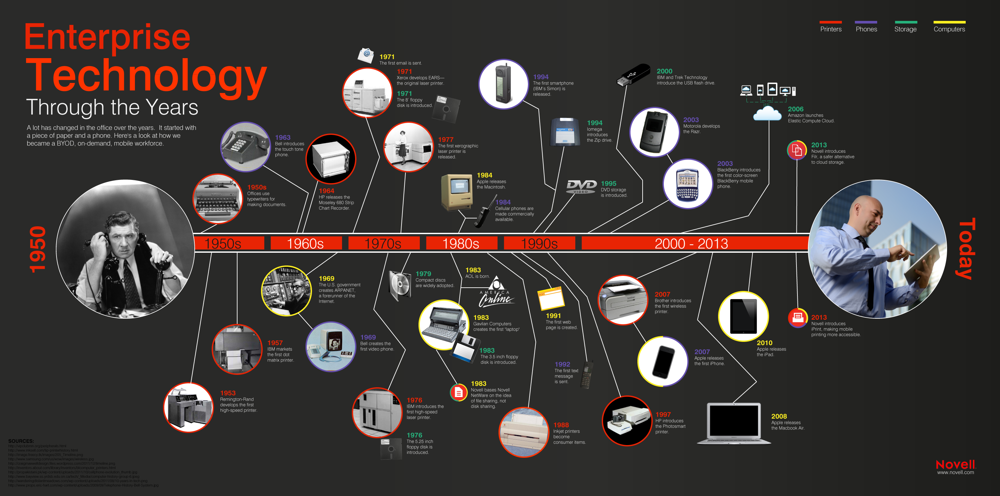

# Future of work

## Setting the scene

Bad start

We live in an ever-changing landscape of Internet businesses. The 80s saw the invention of terminals revolutionizing finance; gaming consoles; and perhaps the biggest disruptor of them all: the PC - introducing a swathe of applications that found its way into the very fabric of everyday businesses. And just when people had wrapped their heads around it, the Internet took it to a whole new level. Everything that we thought was novel, was suddenly yesteryear. Our tools migrated online. And the benefit was obvious: you can store things in "the cloud". Pictures; videos; documents; spreadsheets; presentations; you name it. Not only that you didn't have to care about your data at all times, it was now available to you on the go. There was no excuse for ignoring work email late in the evening. Appointments could be made to anyone from anywhere. Connectivity was stronger than ever before. And as data got bigger, our statistical models got better. Educational videos were now literally at the tip of your fingers. And it had learnt your preferred style also.

We've come a long way since then. And our workplaces are changing again. There is rise of [remote work](https://www.fastcompany.com/90318974/the-rise-of-remote-working-will-continue). Robots that can do the dirty work for us. Emergence of new tools for collaboration. Bots that can read, speak and listen. How will the future of work look like? We can't give accurate predictions, otherwise it'll be [flying cars](https://www.youtube.com/watch?v=kAX9oVWhywA) all over again. But we can study emerging models and begin to forecast how they would evolve over time.
