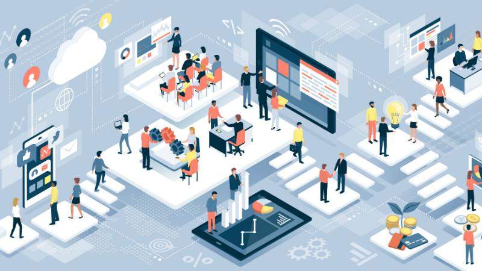
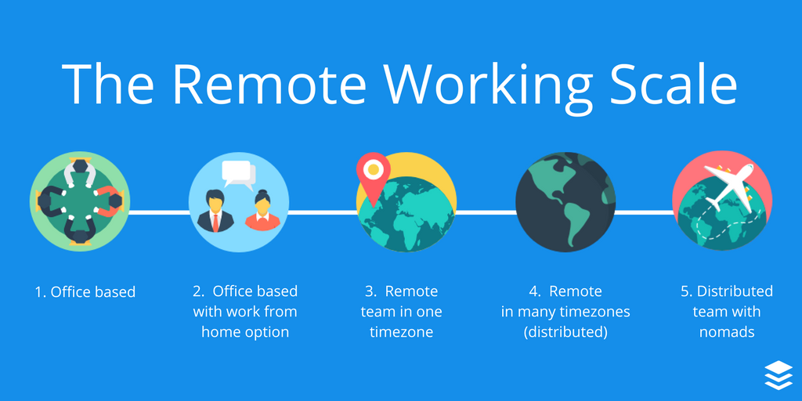
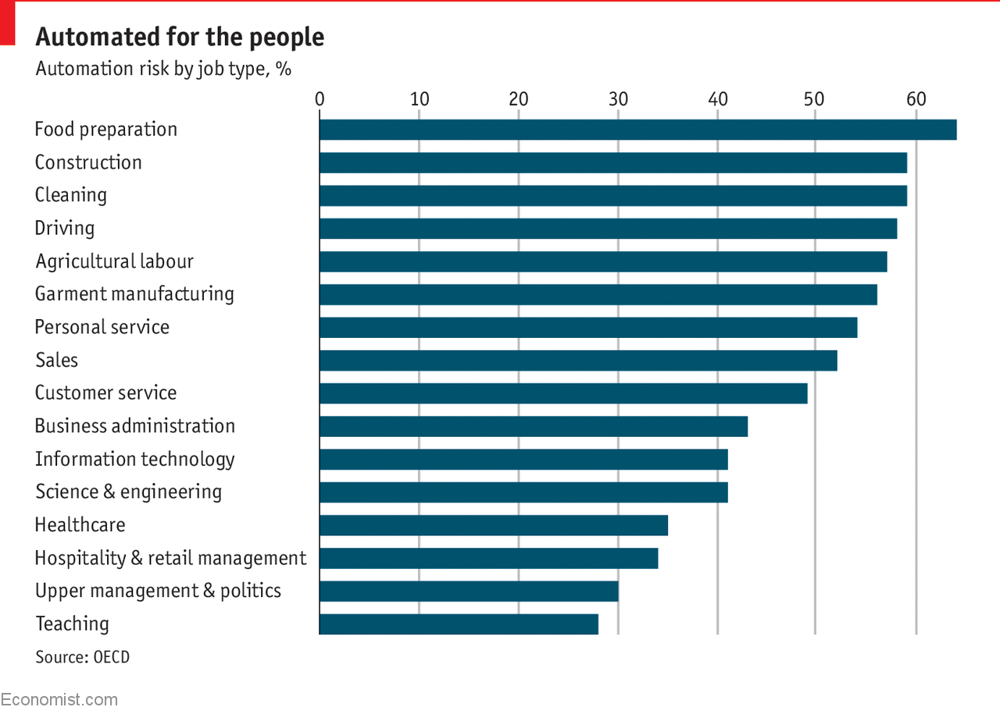
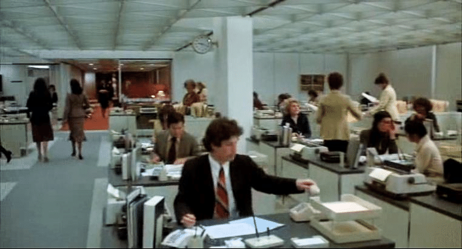

# Rise of remote

## Why now?

What is remote at its core? Is it a fad? A perk to lure skilled workers? Or a societal transformation that will re-mobilize workers? Remote work policies are now a core aspect of workplace dynamics. But it doesn't hold the same meaning for everyone. To a worker at a corporate gig, it might mean being able to work from home once a week. To a consultant who advises his clients in different parts of the world, it could mean less travel. And to a freelancer, it's about less friction is working for an overseas companies. None of those trends are novel, but there has been a [growing buzz](https://twitter.com/search?q=%23futureofwork) in world of venture capital that this form of collaboration will result in a fundamental shift in the way we work with our peers and future peers.

I have been obsessed with this problem ever since I took up a job at an early stage venture that is building an all-inclusive collaboration tool for freelance designers. I wanted to better understand the buzz around remote work and understand at its core what gave rise to the trend. And perhaps, more curiously, fresh from a recent endeavor in the blockchain space, I wanted to investigate whether there exists a relationship with the blockchain ecosystem. Afterall, [a decent amount of blockchain-based companies are fully remote](https://medium.com/zinc_work/why-twice-as-many-blockchain-teams-are-distributed-ca1065ba973b) and the call-to-action is build a decentralized society.

## The data

Since March, Atlassian has expanded to more than 300 remote employees, which amounts to nearly [8% of its workforce](https://www.cnbc.com/2019/12/15/atlassian-offers-remote-work-opportunities-8percent-of-employees-are-remote.html). Approximately a third of Atlassian’s teams currently have a remote worker. At Aetna, 47 percent of workers telecommute, up from 9 percent in 2005. the policy has saved the company \$78 million in real estate costs. In 2009, [IBM reported that 40% of its 386,000 employees in 173 countries were working remotely](https://www.forbes.com/sites/carolkinseygoman/2017/10/12/why-ibm-brought-remote-workers-back-to-the-office-and-why-your-company-might-be-next/#4810674616da). That policy allowed IBM to sell off its office buildings at a gain of almost \$2 billion.

Off-shore development has been steadily growing for the past decade and its [current market size is \$130bn](https://www.ibisworld.com/industry-statistics/market-size/business-process-outsourcing-services-united-states). There are centers in India, China and Ukraine that have successfully established their [dominance in this market segment](https://medium.com/existek/software-development-outsourcing-what-options-do-you-have-c67c94cae9a8). At the same time, digital nomadic lifestyle is on the rise too.

Jessica Lin from [work-bench VC](https://www.work-bench.com/) and Allison Baum from [Trinity Ventures](https://www.trinityventures.com/) have thoroughly explored the topic of the future of work. Their findings conclude that automation and gig-economy has to play a huge role in future workplaces. Some key finding:

- [From 2000–2014 productivity increased by 80 percent, while wages increased a mere 1.2 percent](https://www.epi.org/publication/understanding-the-historic-divergence-between-productivity-and-a-typical-workers-pay-why-it-matters-and-why-its-real/)
- Today, [nearly 5 million people are working part-time](https://www.bls.gov/news.release/empsit.t08.htm) because they can’t get full-time work, and even among people with full-time jobs, [30 percent have been forced to take on extra jobs](http://maristpoll.marist.edu/wp-content/misc/usapolls/us171204_KoC/NPR/NPR_Marist%20Poll_National%20Nature%20of%20the%20Sample%20and%20Tables_January%202018.pdf#page=3?mod=article_inline) to cover their costs.
- The whittling away of the middle class is unfortunately a long-term trend. Sixty-nine percent of Americans ages 18–64 have less than \$1,000 saved.
- Some estimates predict artificial intelligence will automate [up to 47 percent of US jobs in the next ten to twenty years](https://www.economist.com/graphic-detail/2018/04/24/a-study-finds-nearly-half-of-jobs-are-vulnerable-to-automation), forcing us all to adapt faster and more proactively than ever before.

For those reasons, they expect the future of work to be:

1. Automated
2. Distributed
3. Based on gig-economy
4. Data-driven (meritocratic)

A very fascinating idea by Allison Baum are [flipped workplaces](https://qz.com/work/1551999/the-benefits-of-flipped-workplaces-include-protection-from-ai/).

## How do people coordinate?

Until recently, there was no substitute for the office desk work. You'd have to check-in to work at 8 am. Have cup of coffee with your co-workers before settling down for the day of work. And by 6 pm, you'd lock your office door knowing that it is end of the day's work. Rarely, your boss would call you up after work. I remember when I was young how my dad used to hate being in the office after regular hours. There was no substitute for meetings. Meetings with managers, with your colleagues, with external folks who might be collaborating with you on some projects. And I can only imagine how difficult it'd be to work with contractors. Since you can only touch-base with them so many times.

Things have changed considerably. And thankfully for the better for the most part. Yet there is much room for improvement. For one, strict working hours is a thing of the past. It is confined to some limits, but coming at 8 am is just not necessary. And why should it be when you can work from anywhere particularly for matters that require immediate attention. Essentially creating two queues for work items: one that critical in nature and the other that requires thorough-thought. This transition, however, does come at a cost. The biggest one being that over-reliance on critical issues being solved at any time & place means that workers might start feeling overwhelmed - particularly if issues start popping up at night (which has happened to me on quite a few occasions). A potential solution could be to have a georgraphically distributed work-force that can tackle any problem during their normal hours. For now, that's a luxury that only a few teams can afford.

Closely-related, but another great feature of today's work environment is that it's possible to work from home now. Tools such as Slack, Asana and Zoom have ensured that everyone is on the same page at all times. And there is no problem in connecting with folks using Internet-based apps. Again, that has it's disadvantages too. The obvious one being that it adds an extra-overhead. Not only do you have to do the work, you have to ensure that JIRA board reflects your status (which I despise), putting the task item in the correct order, commenting on the ticket if there is anything that needs supervisor attention. Even with all this tooling there is still no substitute for IRL communication.

## Tools

## Problems of remote work

Studies show that people who work at home are significantly more productive but less innovative - John Sullivan

https://www.nytimes.com/2013/02/26/technology/yahoo-orders-home-workers-back-to-the-office.html
http://allthingsd.com/20130222/physically-together-heres-the-internal-yahoo-no-work-from-home-memo-which-extends-beyond-remote-workers/

In face-to-face encounters, our brains process the continual cascade of nonverbal cues that we use as the basis for building trust and professional intimacy. Face-to-face interaction is information-rich. We interpret what people say to us only partially from the words they use. We get most of the message (and all of the emotional nuance behind the words) from vocal cues, facial expressions, and physical movements. And we rely on nonverbal feedback – the instantaneous responses of others – to help us gauge how well our ideas are being accepted. So potent is the nonverbal link between individuals that, when we are in genuine rapport with someone, we subconsciously match our body positions, movements, and even our breathing rhythms with theirs. Most interesting, the brain's ”mirror neurons” mimic not just other people’s behaviors, but their feelings as well. (A reaction referred to as “emotional contagion.”)

Consider this scenario:

Jack: "I spent my whole evening yesterday fixing this issue and I think we should punt it for now. I also diagnosed the root cause of last weeks severity 1 alarm and I think the pipeline was broken, so I've fixed that"

This was the third time Jack has said that. And Michael, usually a very trustful person, was quite skeptical about Jack. He was being quite independent with the issues that he was working on. Michael had no way of knowing how much effort they required. He had a feeling Jack was cheating. And he worked way less than expected of him. But he had no way of knowing for sure.

This is a fairly common problem with employees that work remotely.

I recently had a fasincating conversation with a colleague of mine who had worked with multiple remote teams in the past. I asked him: what is the biggest challenge in remote development that isn't present with in-house development? Gordon had a good answer. When people work together they build models of someone's work personality. They know what certain person is like. How reliable he is when working on open-ended tasks versus how passionate he is about making a change. The same can not be said about remote developers. It's actually quite fascinating for anyone interested in work psychology.

## WeWork fiasco

WeWork really stood out in 2019 and unfortunately, for them for all the wrong reasons. Although WeWork isn't quite dead yet. It is perceived have lost almost all its glory. Adam Neumann is made ridicule of. And everyone is quite skeptical of their prospects. But it's interesting to examine WeWork from the future of work perspective.

---

It's interesting. A co-working workplace that simply offered office rentals - a service I personally used and was fond of. Yet it didn't work. There are many reasons why. But part of the reason was that work itself was evolving. People don't need to be physically co-located at all times. Developments in productivity tools such as Slack and Asana have made it possible to work from pretty much anywhere. On top of that distributed teams are on the rise. Yes, they do face their challenges, but a lot of modern business are coming up with novel ways to tackle these challenges. My goal today is to look at this problem from a variety of lens and make a case that we are ready for a major transformation.

## Is remote work just a perk?

the hidden peril of office work: non-verbal communication

growth numbers - charts (v imp)

remote work standards vs. ditributed offices? secret sauce?

---

> future of work - past

> Where are they mostly located, their growth in numbers (China, India, Romania)

> Why was it not possible before? things that changed

> Movements powered by tools such as slack, zoom

---

### Blockchain

https://twitter.com/uneeb123/status/1218998491877261312

Distributed teams

the technology is founded on the principle of decentralisation and Bitcoin and Ethereum are distributed team success stories

29% of developer jobs with blockchain on Angelist are remote >>>> 15.7% of other developer jobs on Angelist are remote. 22/11/18

https://medium.com/zinc_work/why-twice-as-many-blockchain-teams-are-distributed-ca1065ba973b

Binance team members collaborate across time zones and oceans. Profitability.

https://www.forbes.com/sites/nataliakarayaneva/2019/05/23/the-office-as-a-network-blockchain-as-a-model-for-business/#be561f021f09

DAO

Twitter accounts

https://twitter.com/chris_herd

https://twitter.com/jerseejess

https://twitter.com/Jobvo
