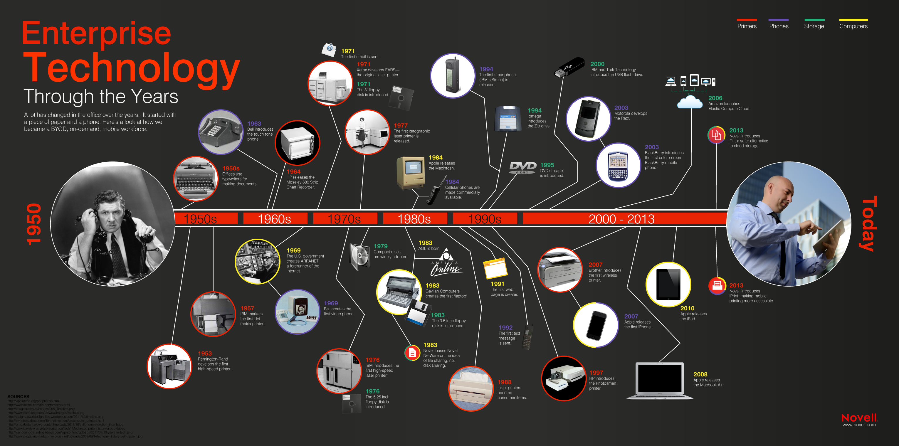

# Future of work

## Setting the scene

We live in an ever-changing landscape of Internet businesses. The 80s saw the invention of terminals revolutionizing finance; gaming consoles; and perhaps the biggest disruptor of them all: the PC - introducing a whole swathe of applications that found its way into the very fabric of everyday businesses. And just when people had wrapped their heads around it, the Internet took it to a whole new level. Everything that we thought was novel, was suddenly yesteryear. Our tools migrated online. The benefit was obvious: you can store things in "the cloud". Pictures; videos; documents; spreadsheets; presentations; you name it. Not only that you didn't have to care about your data at all times, it was now available to you on the go. There was no excuse for ignoring work email late in the evening. Appointments could be made to anyone from anywhere. Connectivity was stronger than ever before. And as data got bigger, our statistical models got better. Educational videos were now literally at the tip of your fingers. And it had learnt your preferred style also.

We've come a long way since then. And our workplaces are changing again. There is rise of [remote work](https://www.fastcompany.com/90318974/the-rise-of-remote-working-will-continue). Emergence of new tools for collaboration. How will the future of work look like? Noone knows for sure. But we can look at some trends.

### How do people coordinate?

Back in the days, there was no substitute for the good old office desk. You'd check-in to work at 8 am. Have cup of coffee with your co-workers before settling down for the day of work. And leaving at 6 pm knowing that this is end of your day. Rarely, your boss would call you up after work. I remember when I was young how my dad used to hate being in the office after regular hours. There was no substitute for meetings. Meetings with managers, with your colleagues, with external folks who might be collaborating with you on some level. I can only imagine how difficult it'd be to work with contractors. Since you can only touch-base with them so many times.

Things have changed considerably. And thankfully for the better. Although there is much room for improvement. Checking-in at 8 am is unneccessary. I am really grateful for the fact that coming in 8 am is no longer critical. Although it does come with its cons. The biggest one being that if there is anything that needs your attention at 11 pm at night, it can be dealt it. So while we prolonged our morning, we have cut short our nights. Another great feature of today's work environment is that it's possible to work from home now. Tools such as Slack, Asana and Zoom have ensured that everyone is on the same page at all times. And there is no problem in connecting with folks using Internet-based apps. Again, that does come with it's disadvantages. The obvious one being that it adds an extra overhead. Not only do you have to do the work, you have to ensure that Jira board reflects your status (I totally suck at that part) and as one would expect, there is still no real substitute for real-life communication.

I recently had a fasincating conversation with a colleague of mine who had worked with multiple remote teams in the past. I asked him: what is the biggest challenge in remote development that isn't present with in-house development? Gordon had a good answer. When people work together they build models of someone's work personality. They know what certain person is like. How reliable he is when working on open-ended tasks versus how passionate he is about making a change. The same can not be said about remote developers. It's actually quite fascinating for anyone interested in work psychology.

### Tools of Trade

### WeWork fiasco

WeWork really stood out in 2019 and unfortunately, for them for all the wrong reasons. Although WeWork isn't quite dead yet. It is perceived have lost almost all its glory. Adam Neumann is made ridicule of. And everyone is quite skeptical of their prospects. But it's interesting to examine WeWork from the future of work perspective.

---

It's interesting. A co-working workplace that simply offered office rentals - a service I personally used and was fond of. Yet it didn't work. There are many reasons why. But part of the reason was that work itself was evolving. People don't need to be physically co-located at all times. Developments in productivity tools such as Slack and Asana have made it possible to work from pretty much anywhere. On top of that distributed teams are on the rise. Yes, they do face their challenges, but a lot of modern business are coming up with novel ways to tackle these challenges. My goal today is to look at this problem from a variety of lens and make a case that we are ready for a major transformation.

## Is remote work just a perk?

the hidden peril of office work: non-verbal communication

growth numbers - charts (v imp)

remote work standards vs. ditributed offices? secret sauce?

---

> future of work - past

> Where are they mostly located, their growth in numbers (China, India, Romania)

> Why was it not possible before? things that changed

> Movements powered by tools such as slack, zoom

---

### Remote work: the perk

Since March, Atlassian has expanded to more than 300 remote employees, which amounts to nearly 8% of its workforce. The majority of those remote employees are in the U.S., including some as far as Hawaii and Montana. In Australia, the farthest employee is located more than 800 miles west of Sydney in Adelaide. To overcome time zone challenges, Atlassian makes sure its remote workers overlap at least four hours of core business hours with their teammates. Approximately a third of Atlassian’s teams currently have a remote worker.
https://www.cnbc.com/2019/12/15/atlassian-offers-remote-work-opportunities-8percent-of-employees-are-remote.html

Studies show that people who work at home are significantly more productive but less innovative - John Sullivan

At Aetna, 47 percent of workers telecommute, up from 9 percent in 2005. the policy has saved the company \$78 million in real estate costs
https://www.nytimes.com/2013/02/26/technology/yahoo-orders-home-workers-back-to-the-office.html
http://allthingsd.com/20130222/physically-together-heres-the-internal-yahoo-no-work-from-home-memo-which-extends-beyond-remote-workers/

In 2009, IBM reported that 40% of its 386,000 employees in 173 countries were working remotely. That policy allowed IBM to sell off its office buildings at a gain of almost \$2 billion.

In face-to-face encounters, our brains process the continual cascade of nonverbal cues that we use as the basis for building trust and professional intimacy. Face-to-face interaction is information-rich. We interpret what people say to us only partially from the words they use. We get most of the message (and all of the emotional nuance behind the words) from vocal cues, facial expressions, and physical movements. And we rely on nonverbal feedback – the instantaneous responses of others – to help us gauge how well our ideas are being accepted. So potent is the nonverbal link between individuals that, when we are in genuine rapport with someone, we subconsciously match our body positions, movements, and even our breathing rhythms with theirs. Most interesting, the brain's ”mirror neurons” mimic not just other people’s behaviors, but their feelings as well. (A reaction referred to as “emotional contagion.”)
https://www.forbes.com/sites/carolkinseygoman/2017/10/12/why-ibm-brought-remote-workers-back-to-the-office-and-why-your-company-might-be-next/#4810674616da

What does the future workplace look like?
https://www.youtube.com/watch?v=3Yqbps1d0sY

---

## Future of work

[From 2000–2014 productivity increased by 80 percent, while wages increased a mere 1.2 percent](https://www.epi.org/publication/understanding-the-historic-divergence-between-productivity-and-a-typical-workers-pay-why-it-matters-and-why-its-real/)

Today, [nearly 5 million people are working part-time](https://www.bls.gov/news.release/empsit.t08.htm) because they can’t get full-time work, and even among people with full-time jobs, [30 percent have been forced to take on extra jobs](http://maristpoll.marist.edu/wp-content/misc/usapolls/us171204_KoC/NPR/NPR_Marist%20Poll_National%20Nature%20of%20the%20Sample%20and%20Tables_January%202018.pdf#page=3?mod=article_inline) to cover their costs.

The whittling away of the middle class is unfortunately a long-term trend. Sixty-nine percent of Americans ages 18–64 have less than \$1,000 saved.

Some estimates predict artificial intelligence will automate [up to 47 percent of US jobs in the next ten to twenty years](https://www.economist.com/graphic-detail/2018/04/24/a-study-finds-nearly-half-of-jobs-are-vulnerable-to-automation), forcing us all to adapt faster and more proactively than ever before.

The American death rate from drugs, alcohol, and mental disorders has [nearly tripled since 1980](https://medicalxpress.com/news/2016-12-american-death-drugs-alcohol-mental.html).

1. Automation
   All predictable, repetitive tasks are automated.
   (https://www.economist.com/graphic-detail/2018/04/24/a-study-finds-nearly-half-of-jobs-are-vulnerable-to-automation)

2. Distribution
   Silicon Valley dethroned

3. Gig economy
   In the U.S., more than 40% of workers are employed in 'alternative work arrangements,'
   such as contingent, part-time or gig work.
   https://www.shrm.org/hr-today/news/all-things-work/pages/gig-workers-challenge-old-order.aspx
   TaskRabbit

4. Data-driven (meritocratic and outcome-focused)
   Flipped workplaces by Allison Baum
   (https://qz.com/work/1551999/the-benefits-of-flipped-workplaces-include-protection-from-ai/)

https://medium.com/trinity-ventures/investing-in-the-future-of-work-eec30f6455e9

#### Jessica Lin

1. Human centered AI

AI and automation will help free up the most mundane, manual, repetitive, labor-intensive parts of a person’s job, to move workers onto higher-value skills and jobs.

2. Agile Learning

---

### Productivity tools

Communication

Background checking distributed teams

https://zinc.work/blog/post/background-checking-global-teams

---

### Freelancer

Currently, 63% of employers have remote workers, yet a majority lack remote work policies.

> Remote work policies?

https://www.fastcompany.com/40537399/remote-work-is-the-new-normal

https://www.upwork.com/i/future-workforce/fw/2019/

---

### Remote offices

---

### Blockchain

Distributed teams

the technology is founded on the principle of decentralisation and Bitcoin and Ethereum are distributed team success stories

29% of developer jobs with blockchain on Angelist are remote >>>> 15.7% of other developer jobs on Angelist are remote. 22/11/18

https://medium.com/zinc_work/why-twice-as-many-blockchain-teams-are-distributed-ca1065ba973b

Binance team members collaborate across time zones and oceans. Profitability.

https://www.forbes.com/sites/nataliakarayaneva/2019/05/23/the-office-as-a-network-blockchain-as-a-model-for-business/#be561f021f09

DAO
